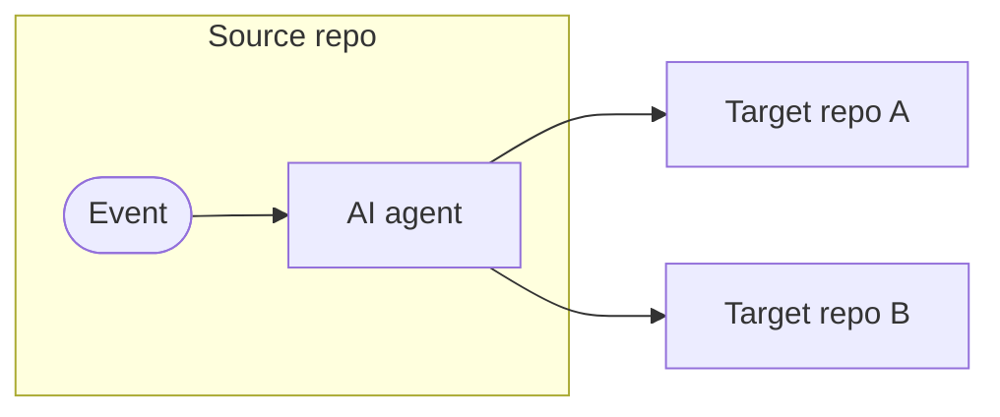
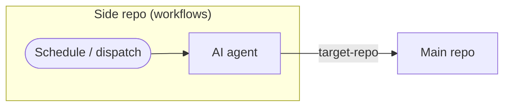
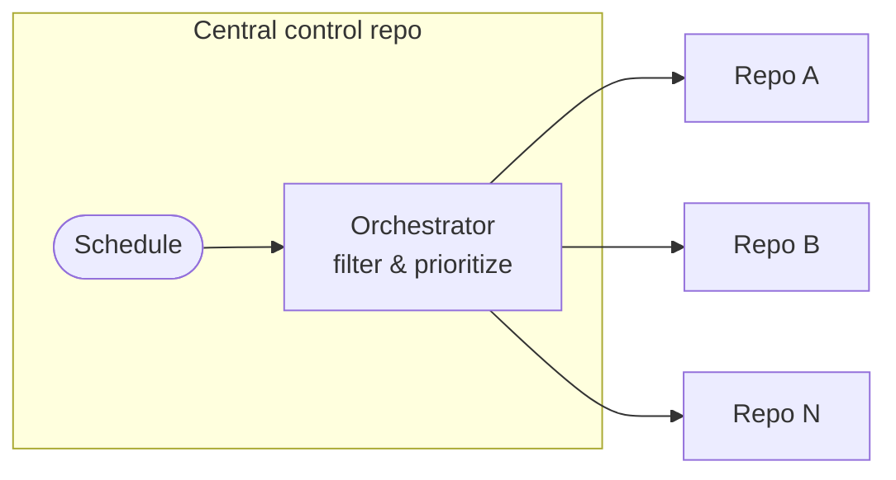
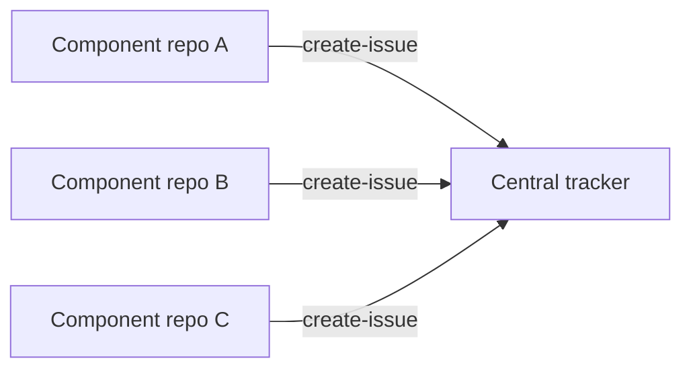
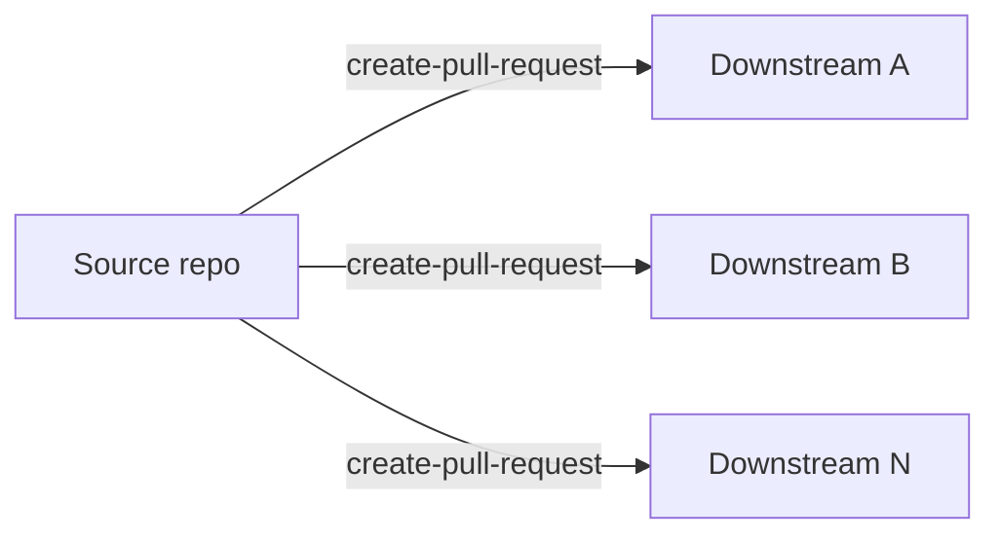

MultiRepoOps extends operational automation patterns (IssueOps, ChatOps, etc.) across multiple GitHub repositories. Using [cross-repository safe outputs](/gh-aw/reference/cross-repository/) and [secure authentication](/gh-aw/reference/auth/), MultiRepoOps enables coordinating work between related projects — creating tracking issues in central repos, synchronizing features to sub-repositories, and enforcing organization-wide policies — all through AI-powered workflows.



## Common MultiRepoOps Patterns

Four topologies cover most use cases:

| Pattern | Description | Examples |
|---------|-------------|---------|
| **Side repository** | Workflows live in a dedicated automation repo and target one or more main repos — keeps AI-generated content isolated from your main codebase | [Triage from Side Repo](/gh-aw/examples/multi-repo/triage-from-side-repo/), [Code Quality Monitoring](/gh-aw/examples/multi-repo/code-quality-monitoring/) |
| **Central control plane** | A private control repo runs a scheduled orchestrator that filters, prioritizes, and dispatches per-repo worker workflows | [Dependabot Rollout](/gh-aw/examples/multi-repo/dependabot-rollout/) |
| **Hub-and-spoke** | Component repos each push events to a central tracker via `target-repo` — aggregates signals from many sources into one place | [Cross-Repo Issue Tracking](/gh-aw/examples/multi-repo/issue-tracking/) |
| **Upstream-to-downstream** | Source repo propagates changes outward to one or more downstream repos via PRs; `max` controls fan-out breadth | [Feature Synchronization](/gh-aw/examples/multi-repo/feature-sync/) |

## The Side Repository Pattern (Isolated Automation)

A **side repository** is a dedicated automation repo that runs workflows targeting one or more main codebases. This keeps AI-generated issues, comments, and workflow runs isolated from your main repository — no changes needed to existing projects and no mixing of automation infrastructure with production code.



Teams new to agentic workflows can adopt this pattern: create a private repository, add a PAT as a secret, and point `target-repo` at your main codebase. No changes required to the main repo.

```aw wrap
---
on: weekly on monday

safe-outputs:
  github-token: ${{ secrets.GH_AW_MAIN_REPO_TOKEN }}
  create-issue:
    target-repo: "my-org/main-repo"
    labels: [automation, weekly-check]
    max: 5

tools:
  github:
    github-token: ${{ secrets.GH_AW_MAIN_REPO_TOKEN }}
    toolsets: [repos, issues, pull_requests]
---

# Weekly Repository Health Check

Analyze my-org/main-repo and create issues for stale PRs (>30 days), failed CI runs on main, and open security advisories.
```

Using [Slash commands](/gh-aw/reference/command-triggers/) from a side repo require a bridge: a thin relay workflow in the main repo listens for the command and forwards it via `workflow_dispatch` to the side repo. See [Triage from Side Repo](/gh-aw/examples/multi-repo/triage-from-side-repo/) for a complete walkthrough.

Authentication details and step-by-step setup are covered in the [Triage from Side Repo](/gh-aw/examples/multi-repo/triage-from-side-repo/) and [Code Quality Monitoring](/gh-aw/examples/multi-repo/code-quality-monitoring/) examples, and in the [Authentication reference](/gh-aw/reference/auth/).

## The Central Control Plane Pattern (Org-Wide Rollouts)

For large-scale operations — security patches, policy rollouts, configuration standardization — use a **single private repository as a control plane**. An orchestrator workflow filters and prioritizes targets, then dispatches per-repo worker workflows.



This pattern supports phased adoption (pilot waves first), central governance, security-aware prioritization, and a complete decision trail — without pushing `main` changes to individual target repositories.

**Orchestrator** (`dispatch-workflow` safe output + `max` limit):
```aw wrap
---
on:
  schedule: weekly on monday

tools:
  github:
    github-token: ${{ secrets.GH_AW_READ_ORG_TOKEN }}
    toolsets: [repos]

safe-outputs:
  dispatch-workflow:
    workflows: [worker-workflow]
    max: 5
---

# Rollout Orchestrator

Filter repositories, categorize by complexity, prioritize the rollout order, and dispatch the worker workflow for each selected repository. Summarize candidates, breakdown, and rationale.
```

**Worker** (`checkout` + `target-repo` safe outputs per dispatched repo):
```aw wrap
---
on:
  workflow_dispatch:
    inputs:
      target_repo:
        description: 'Target repository (owner/repo format)'
        required: true
        type: string

checkout:
  repository: ${{ github.event.inputs.target_repo }}
  github-token: ${{ secrets.ORG_REPO_CHECKOUT_TOKEN }}
  current: true

safe-outputs:
  github-token: ${{ secrets.GH_AW_CROSS_REPO_PAT }}
  create-pull-request:
    target-repo: ${{ github.event.inputs.target_repo }}
    max: 1
---

# Worker: Apply Changes to Target Repository

Analyze ${{ github.event.inputs.target_repo }}, apply the required changes, and create a pull request explaining what was changed and why.
```

Keep orchestrator permissions narrow; delegate repo-specific writes to workers. Add correlation IDs to dispatch inputs for tracking. See the [Dependabot Rollout example](/gh-aw/examples/multi-repo/dependabot-rollout/) for a complete end-to-end walkthrough.

## The Hub-and-Spoke Pattern

Each component repository runs its own workflow that forwards events to a central tracker via `target-repo`. The central repository accumulates a unified view without needing direct access to individual component repos.



Useful for component-based architectures where multiple teams need a shared visibility layer, cross-project initiatives, or aggregating metrics from distributed repositories. See [Cross-Repo Issue Tracking](/gh-aw/examples/multi-repo/issue-tracking/) for a complete example.

## The Upstream-to-Downstream Pattern

The source repository propagates changes outward to downstream repos whenever relevant paths change. The agent adapts the changes for each target's structure and opens a pull request for review.



Use `max` to control fan-out breadth, and `title-prefix` plus labels to make the automated PRs easy to filter. See [Feature Synchronization](/gh-aw/examples/multi-repo/feature-sync/) for a complete example.

## Cross-Repository Safe Outputs

Most safe output types support `target-repo` to write to external repositories, and `allowed-repos` for dynamic multi-target workflows. See [Cross-Repository Safe Outputs](/gh-aw/reference/cross-repository/#cross-repository-safe-outputs) for the complete list and configuration options, including `target-repo: "*"` for runtime-determined targets and the [GitHub Tools reference](/gh-aw/reference/cross-repository/#cross-repository-reading) for reading from private repositories.

## Deterministic Multi-Repo Workflows

For direct repository access without agent involvement, check out multiple repositories using `checkout:` frontmatter or `actions/checkout` steps. See the [Deterministic Multi-Repo example](/gh-aw/reference/cross-repository/#example-deterministic-multi-repo-workflows) in the cross-repository reference.

## Example Workflows

Explore detailed MultiRepoOps examples:

- **[Feature Synchronization](/gh-aw/examples/multi-repo/feature-sync/)** — Sync code changes from main repo to sub-repositories
- **[Cross-Repo Issue Tracking](/gh-aw/examples/multi-repo/issue-tracking/)** — Hub-and-spoke tracking architecture
- **[Dependabot Rollout](/gh-aw/examples/multi-repo/dependabot-rollout/)** — Org-wide orchestrator + worker rollout from a central control repo
- **[Triage from Side Repo](/gh-aw/examples/multi-repo/triage-from-side-repo/)** — Automated issue triage running from an isolated automation repository
- **[Code Quality Monitoring](/gh-aw/examples/multi-repo/code-quality-monitoring/)** — Scheduled quality checks from a side repository with checkout

## Best Practices

Use GitHub Apps over PATs for automatic token revocation; scope tokens minimally to target repositories. Set appropriate `max` limits and consistent label/prefix conventions. Test against public repositories first before rolling out to private or org-wide targets.

## Related Documentation

- [IssueOps](/gh-aw/patterns/issue-ops/) — Single-repo issue automation
- [ChatOps](/gh-aw/patterns/chat-ops/) — Command-driven workflows
- [Cross-Repository Operations](/gh-aw/reference/cross-repository/) — Checkout and `target-repo` configuration
- [Safe Outputs](/gh-aw/reference/safe-outputs/) — Complete safe output configuration
- [GitHub Tools](/gh-aw/reference/github-tools/) — GitHub API toolsets
- [Authentication](/gh-aw/reference/auth/) — PAT and GitHub App setup
- [Reusing Workflows](/gh-aw/guides/packaging-imports/) — Sharing workflows across repos
